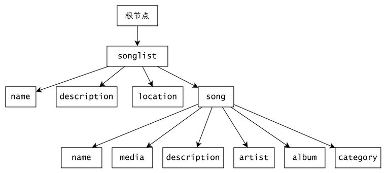

# UniList语法指南

---

UniList是一种类似于YAML的简单配置文件格式，一般扩展名为`.ulist`。相比于JSON或YAML，它具有以下特点:

- 简单 —— 没有复杂的数据表示形式，所有数据只有一种"字符串"类型。

- 易读易解析 —— 以类似于YAML的缩进方式组织文本，容易理解。

下述UniList的语法体系。

## 注释与文件编码

标准状况下，以`#`开头直到行尾的内容都是注释，引号里的`#`除外。UniList不支持多行注释。

当前UniList仅支持UTF-8编码。以后会考虑增加与编码相关的语法结构。

## 数据的组织形式

UniList采用`属性名称: "属性值"`的方式标注数据。其中，属性名称可以采用除冒号与空格符(space, tab,...)以外的任何字符；此外，属性名称是大小写敏感的，因此`Name`与`name`是两个不同的属性名称。属性值包含在双引号里，其**类型只有字符串**。当然你可以把这个字符串解析为任意类型的值。UniList的每一行表示一组数据，因此属性值不可以换行。

作为配置文件存储时，UniList采用以下方式存储特殊字符:

| 特殊字符 | 转义字符 |
|:----:|:----:|
| 换行符  | `\n` |
| `"`  | `\"` |
| `\`  | `\\` |

### 缩进

对于对象这样的复杂数据，UniList使用缩进表示。不过与YAML不同的是，UniList缩进只能使用Tab(以后可能会支持空格: 1Tab = 4空格). 比如一个只有一首歌的歌单可以这么表示(语法高亮使用YAML格式):

```yaml
# songs.ulist -- 一个简单的歌单
songlist:
	name: "Just For Fun"
	description: "Bob的歌单"
	location: "./Just For Fun/" # 文件夹位置
	song:
		name: "NSMBU Overworld- Moon"
		media: "Nintendo Sound Team - NSMBU Overworld - Moon[mqms].ogg" # 文件位置
		description:
		artist: "Nintendo Sound Team"
		album: "Super Mario Maker 2"
		category: "Game Sound Track"
```

画成图是这样的：



### 数组

很显然，一张歌单里不只有一首歌，因此需要使用UniList的数组功能。

UniList使用多个名称相同的属性模拟数组:

```yaml
# songs.ulist -- 一个简单的歌单
songlist:
	name: "Just For Fun"
	description: "Bob的歌单"
	location: "./Just For Fun/" # 文件夹位置
	song:
		name: "NSMBU Overworld- Moon"
		media: "Nintendo Sound Team - NSMBU Overworld - Moon[mqms].ogg" # 文件位置
		description:
		artist: "Nintendo Sound Team"
		album: "Super Mario Maker 2"
		category: "Game Sound Track"
	song:
		name: "SMW Athletic- Moon"
		media: "Nintendo Sound Team - SMW Athletic- Moon[mqms].ogg"
		description:
		artist: "Nintendo Sound Team"
		album: "Super Mario Maker 2"
		category: "Game Sound Track"
```

也可以模拟YAML的做法，不过数组成员要加上冒号：

```yaml
# songs.ulist -- 一个简单的歌单
songlist:
	name: "Just For Fun"
	description: "Bob的歌单"
	location: "./Just For Fun/" # 文件夹位置
	songs:
		-:
			name: "NSMBU Overworld- Moon"
			media: "Nintendo Sound Team - NSMBU Overworld - Moon[mqms].ogg" # 文件位置
			description:
			artist: "Nintendo Sound Team"
			album: "Super Mario Maker 2"
			category: "Game Sound Track"
		-:
			name: "SMW Athletic- Moon"
			media: "Nintendo Sound Team - SMW Athletic- Moon[mqms].ogg"
			description:
			artist: "Nintendo Sound Team"
			album: "Super Mario Maker 2"
			category: "Game Sound Track"
```

以上。
